# 必要软件的下载

从零开始进行工作营内容，我们需要下载以下两个软件

- [Visual Studio Code (VSCODE)](https://code.visualstudio.com/)
- [Anaconda（自行配置网络环境）](https://www.anaconda.com/)

## VSCODE安装指南

进入VSCODE官网进行下载
点击下图所示下载按钮（实际请根据自身电脑情况判断）

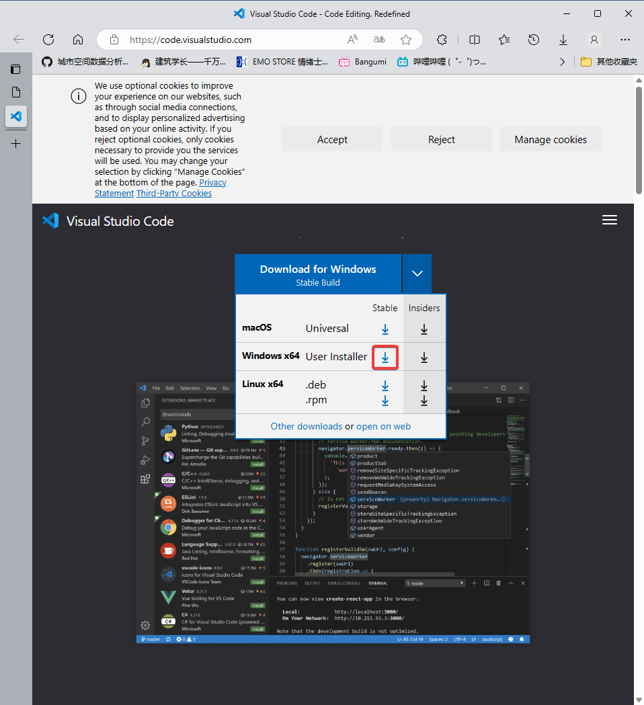

安装流程借用CSDN上的大大[9.冄2.7.號](https://blog.csdn.net/weixin_44950987/article/details/128129613)的VSCODE安装教程截图进行指南


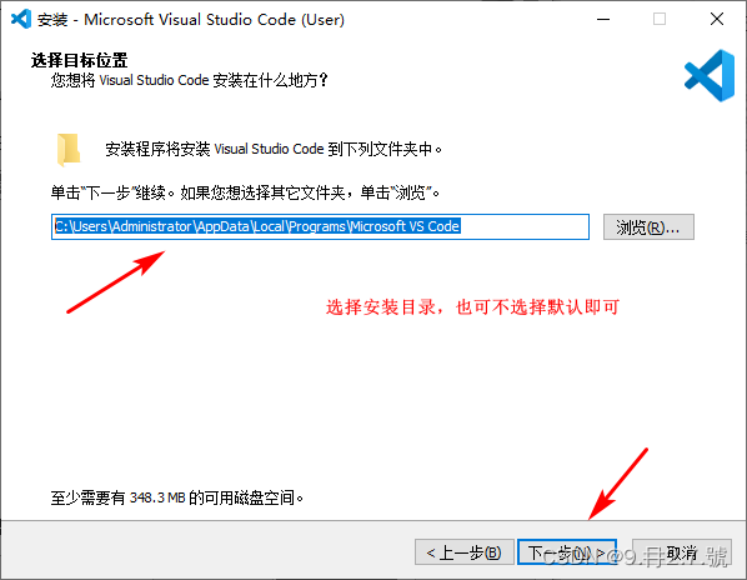

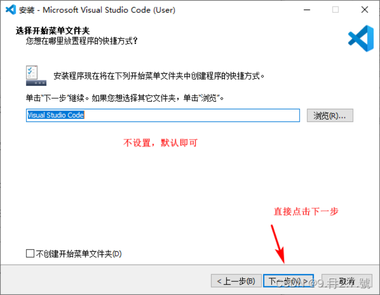

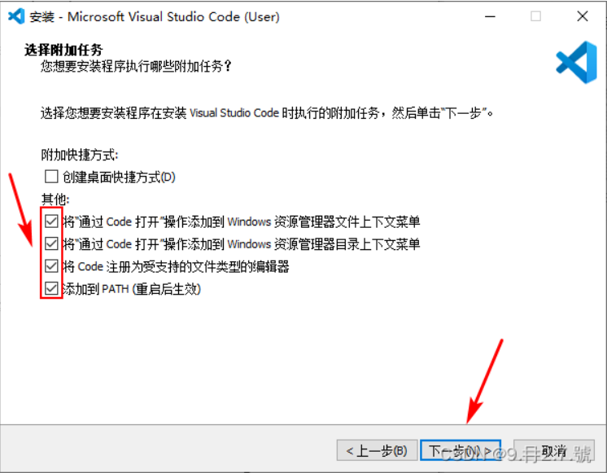

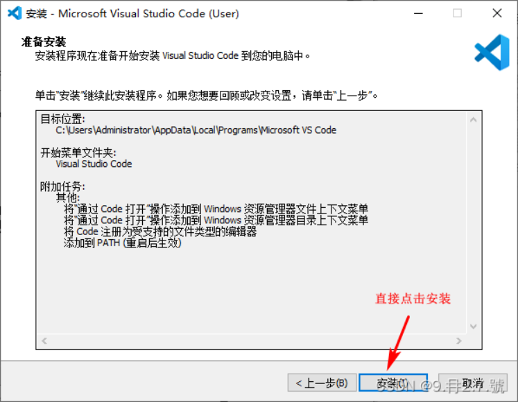

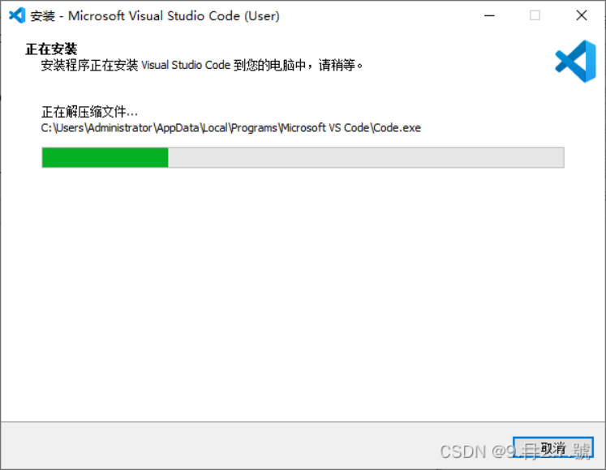


以上，VSCODE安装完成，我们需要进入软件进行一定配置

## 配置VSCODE

首次打开软件之后，点击下图所示标志，这个标志用于安装软件拓展工具

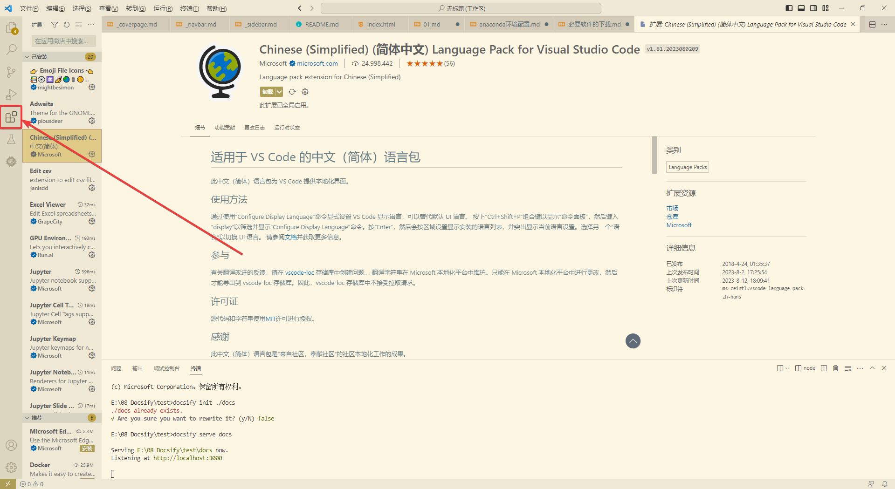

搜索chinese，可以简单找到简体中文语言包，进行安装

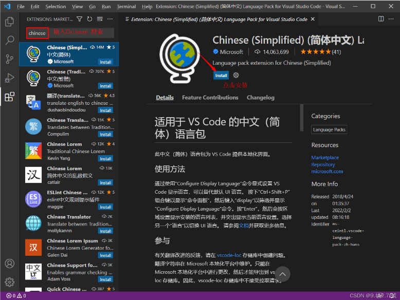

在安装完毕后，按下“Ctrl+Shift+P”组合键以显示“命令面板”，然后键入“display”以筛选并显示“Configure Display Language”命令。按“Enter”，然后会按区域设置显示安装的语言列表，并突出显示当前语言设置。选择另一个“语言”以切换 UI 语言。

在切换完成后重启VSCODE，VSCODE的中文插件安装就完成了

## VScode中python必要插件

由于没有重新安装VSCODE的条件，我将在此罗列本人已安装的插件，请安装这些插件以保证后续工作的顺利进行

- Python
- Pylance
- Vetur
- Python Indent
- Jupyter Slide Show
- Jupyter Notebook Renderers
- Jupyter Keymap
- Jupyter Cell Tags
- Excel Viewer
- Edit csv

也可以根据自身需要安装其他VScode插件，VScode作为一款开源软件，拥有极其丰富的第三方插件，可以帮助我们配置自己喜欢的编程环境。

## Anaconda安装指南

使用Anaconda进行环境配置是最令本人头疼的一件事，多亏了Anaconda和愚蠢的自己，使得我在工作营中重装了两次电脑......

使用科学上网工具进入Anaconda官网进行下载


安装流程如下

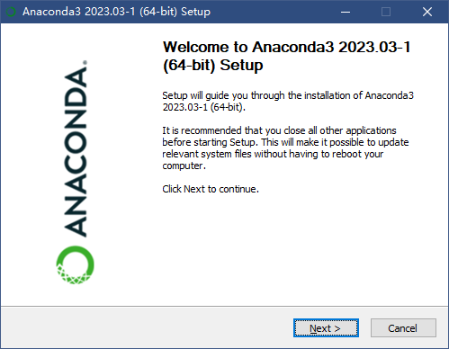

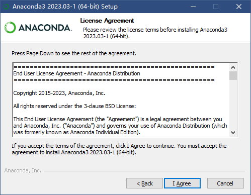

> [!WARNING]
> 请选择 just me 而不是 All users ，否则后续使用可能会面临权限问题。

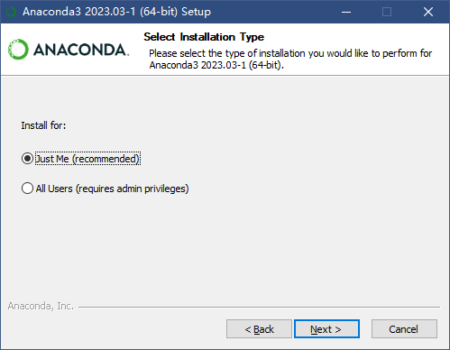

此处为anaconda选择安装路径，建议安装在存储空间较大的磁盘中

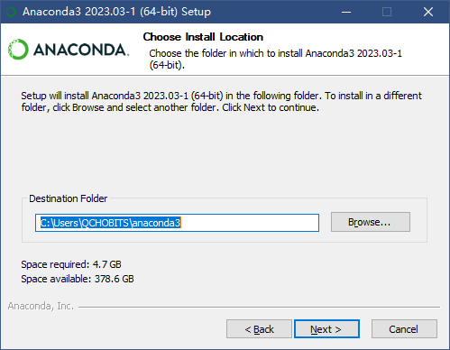

此处请选择前三个选项

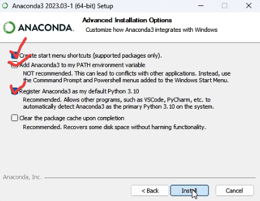

后续就安心进行安装即可，安装时间略长。

安装完成后或许会弹出网页，无视即可

桌面上不会有任何图标新增

## 配置Anaconda

> [!NOTE]
> **为什么要使用anaconda配置虚拟环境**
>
> 使用虚拟环境可以保护你的计算机base环境，由于部分库之间可能会有冲突的情况出现，使用虚拟环境可以保证python各个环境的相对独立，在以后打包程序时也有利于减小文件的大小。

使用 **win+S** 快捷键调出搜索框，搜索 anaconda navigator ，打开小绿标（打开时间略长，需要稍等一下）


首次打开 anaconda navigator 后，在红框所示区域或许有 upgrade now ，请科学上网并及时更新

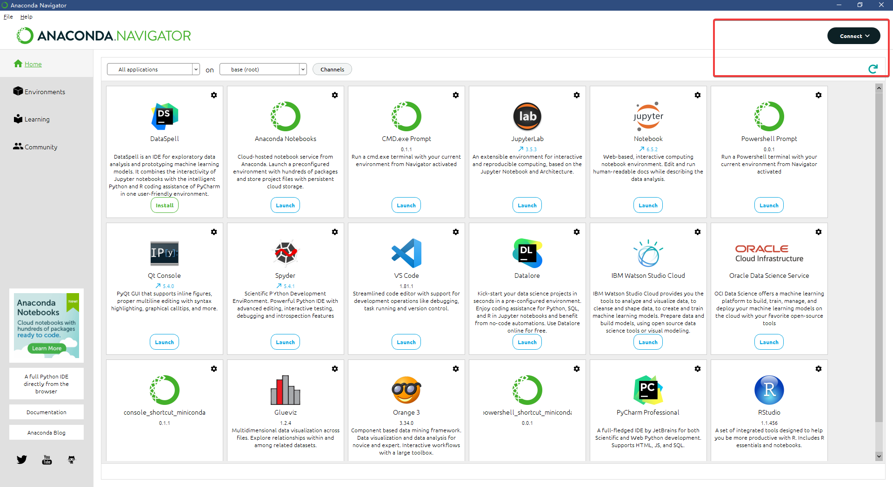

更新后重新进入 anaconda navigator ，找到 environment 中的 base 环境
> [!WARNING]
> 为了保障初学者学习anaconda时默认环境的稳定运行，请避免在base环境中进行过多额外的操作！

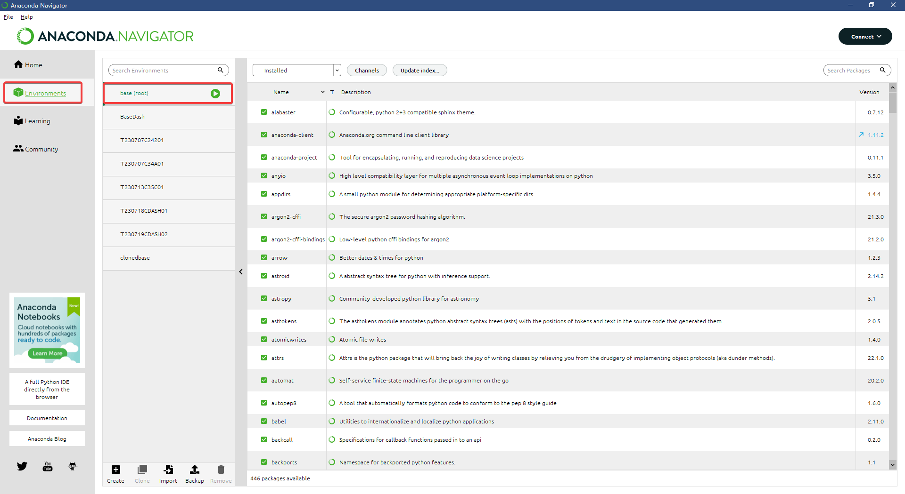

我们现在需要做的是克隆base环境以进行后续操作，又因为不同的代码所需的环境略有不同，因此我们先克隆一个base环境作为基础环境，再克隆这个基础环境以配置不同代码所需的多样环境

克隆base环境教程借用CSDN上的大大[柒AII](https://blog.csdn.net/qq_41656402/article/details/131015711)和大大[YL_python_C++_java](https://blog.csdn.net/java_pythons/article/details/121827433)所撰写的教程进行流程罗列

打开powershell，使用conda creat命令克隆环境

在窗口中输入

``` sh
conda create -n clonedbase --clone base
```

来进行base环境的克隆，此处我们将克隆的base环境命名为clonedbase

环境的克隆过程需要一定时间，请耐心等待

> [!TIP]
> 仅有base环境克隆需要使用sh，后续环境的克隆可以使用 anaconda navigator 中的 **Clone** 工具进行操作

克隆完毕后可以在 anaconda navigator 的 environment 中看到两个环境，分别为 base 和 clonedbase
将光标移动到对应环境上可以看到环境所处根目录位置，以本人为例，clonedbase在 D:\anaconda3\envs\clonedbase 中

> [!WARNING]
> 如若克隆环境不在 anaconda 的安装路径中，那么说明你可能没有选择 just me ，而是选择了 all users 。
>
> 出现了以上情况请自行解决。

在基础环境克隆完成过后，我们可以用同样的操作来克隆其他环境，正如截图所示，我在每个代码环节都创建了一个新的虚拟环境进行操作。

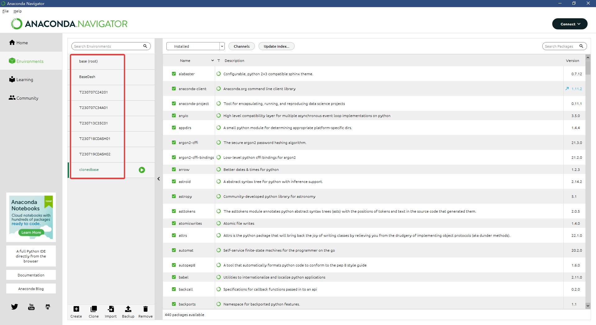
