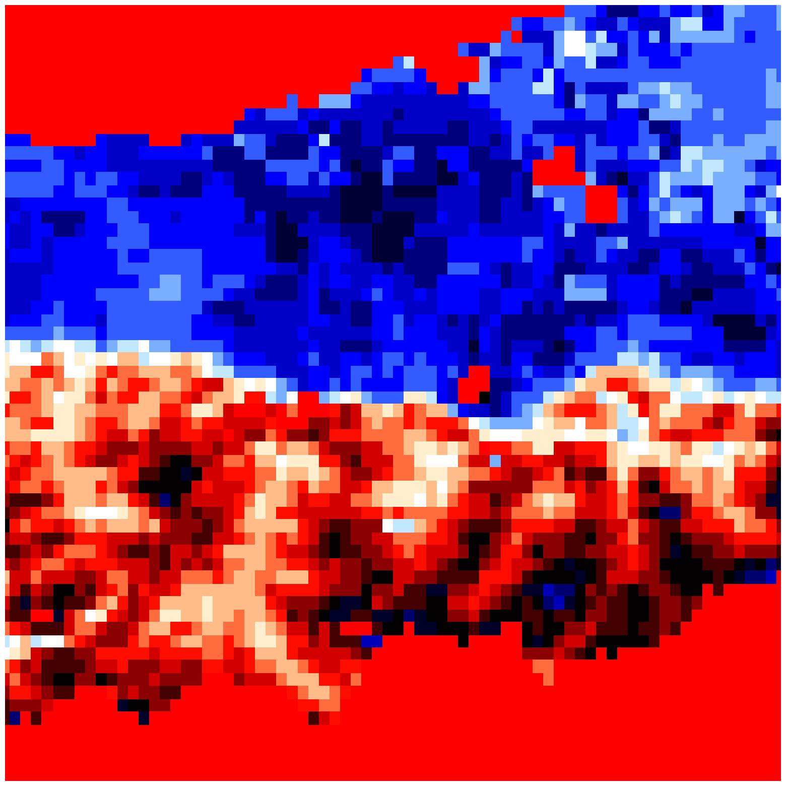
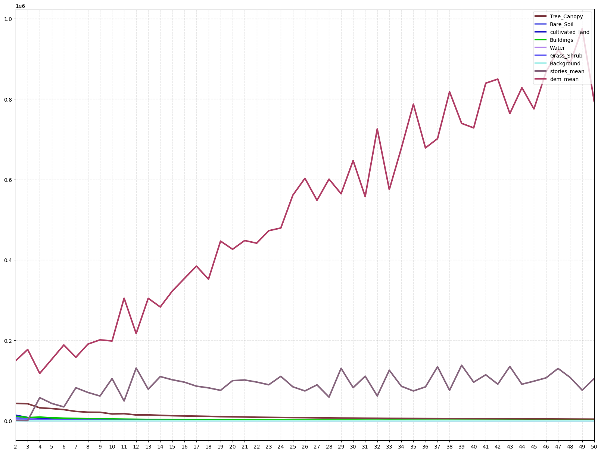
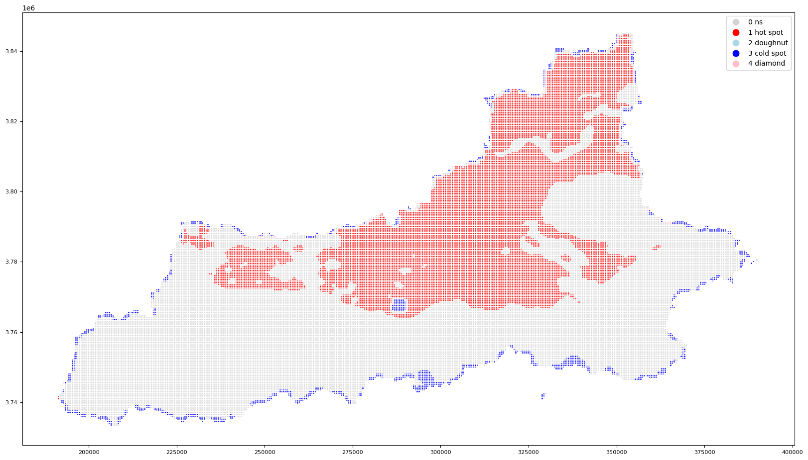

# 聚类部分

## 基础环境配置

首先我们仍然需要创建一个为这次工作的代码运行的虚拟环境，具体请看 [01 前期准备](work/01%20前期准备/必要软件的下载.md) 中的内容

在创建完环境后，我们需要导入依赖的库。由于依赖过多，下文不进行罗列，直接展示环境安装代码。

``` sh
pip install python-benedict
pip install rasterstats
pip install moviepy
pip install opencv-contrib-python
pip install libpysal
pip install usda
pip install connected-components-3d
pip install rioxarray
pip install mayavi
```

接下来将会是代码演示部分

## 导入所需要的库

```python
import warnings
warnings.filterwarnings('ignore')

from usda.utils import AttrDict
import usda.database as usda_database
import usda.geodata_process as usda_geoprocess
import usda.models as usda_model 
import usda.pattern_signature  as usda_signature
from usda import data_visualization as usda_vis
from usda import network as usda_network
from scipy.stats import zscore

import matplotlib.pyplot as plt
import matplotlib
import rasterio as rio
import earthpy.plot as ep
import copy
import numpy as np
from rio_tiler.io import COGReader
import geopandas as gpd
import pandas as pd
import seaborn as sns
```

## 2.1 查看和处理所需要的数据

定义一个字典，储存所有需要的文件路径信息和投影参数

```python
# 创建一个自定义字典类对象
__C = AttrDict()

# 设置 args 变量等于 __C，args 变量可以被用来访问 __C 中的属性
args = __C

# 设置一些常量值
__C.gi = AttrDict()  # gi 属性包含地理信息（geographic information）
__C.gi.epsg_wgs84 = 4326  # WGS84 坐标系的 EPSG 编码
__C.gi.xian_epsg = 32649  # 西安所在地的投影坐标系的 EPSG 编码

# 设置一些文件路径
__C.data = AttrDict()  # data 属性包含数据文件路径

__C.data.footprint_wgs84_fn = './geodata/建筑轮廓数据.json'  # WGS84 坐标系下的建筑物轮廓数据文件路径
__C.data.footprint_projected_fn = './geodata/xian_Building_Footprints_projected.shp'  # 投影坐标系下的建筑物轮廓数据文件路径
__C.data.stories_fn = './geodata/xian_building_stories.tif'  # 西安建筑物高度数据文件路径

__C.data.landuse_fn = './geodata/土地利用栅格.tif'  # 西安土地利用数据文件路径
__C.data.landcover_fn = './geodata/土地覆盖数据.tif'  # 西安土地覆盖数据文件路径

__C.data.lst_winter_fn = './geodata/1月lst.tif'  # 西安冬季地表温度数据文件路径
__C.data.lst_summer_fn = './geodata/7月lst.tif'  # 西安夏季地表温度数据文件路径

__C.data.nightlight_fn = './geodata/西安夜间灯光.tif'  # 西安夜间灯光数据文件路径

__C.data.dem_fn = './geodata/xian-dem30.tif'  # 西安数字高程模型数据文件路径

__C.data.xian_boundary_fn = './geodata/边界数据/Export_Output.shp'  # 西安市边界数据文件路径

__C.data.zs_gdf_fn = './geodata/zonal_stats_gdf.gpkg'  # 包含区域统计数据的文件路径
__C.data.zs_norm_gdf_fn = './geodata/zonal_stats_norm_gdf.gpkg'  # 包含归一化区域统计数据的文件路径
```

### 建筑轮廓格式转换与高度查看

定义`json2gdf()`方法将JSON格式数据读取为GeoDataFrame格式，并存储为SHP格式用于调用定义的`create_multiband_raste()`方法，将SHP转为栅格数据，栅格单元大小同一配置为10m，投影同一配置为`EPSG:32616`（西安地区的wgs投影坐标系）。

```python
building_footprints=usda_database.json2gdf(args.data.footprint_wgs84_fn,numeric_columns={'id':'int','Floor':'int'},epsg=args.gi.xian_epsg) 
building_footprints.to_file(args.data.footprint_projected_fn) # 读取json的四个字段，并转换为shp格式
usda_geoprocess.create_multiband_raster(['Floor'],args.data.footprint_projected_fn,args.data.stories_fn,cellSize=10,NoData_value=0)  # 将shp格式文件转换为tif栅格文件
```

这样就将矢量数据转换为了栅格数据。

```output
The raster was written successfully!
```

调用`tiled_web_map_show()`方法打印地图是，可以配置球面墨卡托投影金字塔缩放比例z参数，为0-23级，显示的范围越大，数值越大。参数`centroid_latlon`可以配置缩放的中心点，为经纬度，选取了西安地区的坐标(34.260718,108.942363)。

```python
centroid_latlon=(34.260718,108.942363)
_=usda_geoprocess.tiled_web_map_show(args.data.stories_fn,z=12,cmap='hot',centroid_latlon=centroid_latlon,figsize=(20,20)) 
```

```output
CRS: EPSG:32649
影像边界坐标： (108.74570152822511, 34.038127626452386, 109.30989614117387, 34.39614873120865)
瓦片的形状： (512, 512, 1)
```


### 查看土地利用数据

> 使用了清华大学中国基本城市土地利用（EULUC-China）数据。[点击查看](https://www.sciencedirect.com/science/article/abs/pii/S2095927319307054)

```python
np.random.seed(0)
cmap=matplotlib.colors.ListedColormap (np.random.rand(256,3))

_=usda_geoprocess.tiled_web_map_show(args.data.landuse_fn,z=12,cmap=cmap,centroid_latlon=centroid_latlon,figsize=(20,20))
```

```output
CRS: EPSG:4326
影像边界坐标： (108.024053259, 33.995933444, 109.428795838, 34.703087236)
瓦片的形状： (512, 512, 1)
```


### 查看土地覆盖数据

```python
_=usda_geoprocess.tiled_web_map_show(args.data.landcover_fn,z=12,cmap=cmap,centroid_latlon=centroid_latlon,figsize=(20,20))
```

```output
CRS: EPSG:32649
影像边界坐标： (107.62185123721373, 33.6907444341707, 109.82322460725076, 34.748597879145635)
瓦片的形状： (512, 512, 1)
```


### 查看地表温度（LST） 数据

西安地区冬季地表温度数据

```python
lst_tile=usda_geoprocess.tiled_web_map_show(args.data.lst_winter_fn,z=9,cmap='flag',centroid_latlon=centroid_latlon,figsize=(20,20))
```

```output
CRS: EPSG:4326
影像边界坐标： (107.6682056337595, 33.69935638085008, 109.81094961613417, 34.74177237227559)
瓦片的形状： (512, 512, 1)
```



西安地区夏季地表温度数据

```python
lst_tile=usda_geoprocess.tiled_web_map_show(args.data.lst_summer_fn,z=9,cmap='flag',centroid_latlon=centroid_latlon,figsize=(20,20))
```

```output
CRS: EPSG:4326
影像边界坐标： (107.6682056337595, 33.69935638085008, 109.81094961613417, 34.74177237227559)
瓦片的形状： (512, 512, 1)
```


### 查看数字高程（dem）数据

```python
centroid_latlon=(34.260718,108.942363)
lst_tile=usda_geoprocess.tiled_web_map_show(args.data.dem_fn,z=12,cmap='copper',centroid_latlon=centroid_latlon,figsize=(20,20))
```

```output
CRS: EPSG:4326
影像边界坐标： (107.65914916992188, 33.69575500488281, 109.81727600097656, 34.743919372558594)
瓦片的形状： (512, 512, 1)
```


### 查看夜间灯光数据

```python
nighlight_tile=usda_geoprocess.tiled_web_map_show(args.data.nightlight_fn,z=9,cmap='hot',centroid_latlon=centroid_latlon,figsize=(20,20))
```

```output
CRS: EPSG:4326
影像边界坐标： (107.660418968, 33.697916336, 109.814585652, 34.743749678)
瓦片的形状： (512, 512, 1)
```


## 2.2 多源数据的区域统计与数据合并

将西安市域范围按照边长为500m方格进行划分

```python
boundary=gpd.read_file(args.data.xian_boundary_fn)
boundary.to_crs(args.gi.xian_epsg,inplace=True)

grids=usda_geoprocess.rec_quadrats_bounded_gdf(boundary,h_distance=500,v_distance=500)
print(grids.shape)
```

得到39545个样方

```output
(39545, 1)
```

查看划分好的地图

```python
grids.boundary.plot(figsize=(20,20));
```


```python
raster_info={    
    'lstwinter':[args.data.lst_winter_fn,'mean'],
    'lstsummer':[args.data.lst_summer_fn,'mean'],
    'stories':[args.data.stories_fn,'mean'],    
    'dem':[args.data.dem_fn,'mean'],
    'nightlight':[args.data.nightlight_fn,['mean']],
    'landuse':[args.data.landuse_fn,'frequency'],
    'landcover':[args.data.landcover_fn,'frequency'],
    }

zs_gdf=usda_geoprocess.zonal_stats_raster_batch(raster_info,grids,upscale_mu=2) 
zs_gdf.to_file(args.data.zs_gdf_fn,driver='GPKG')
```

```output
Processing img: 1/7-lstwinter
resampling upscale=5
Processing img: 2/7-lstsummer
resampling upscale=5
Processing img: 3/7-stories
Processing img: 4/7-dem
Processing img: 5/7-nightlight
Processing img: 6/7-landuse
Processing img: 7/7-landcover
```

```python
zs_gdf=gpd.read_file(args.data.zs_gdf_fn)
# zs_gdf.fillna(0,inplace=True)
print(zs_gdf.shape)
print(zs_gdf.columns)
zs_gdf.head(3)
```

```output
(39545, 26)
Index(['on', 'lstwinter_mean', 'lstsummer_mean', 'stories_mean', 'dem_mean',
       'nightlight_mean', 'landuse_fre_0.0', 'landuse_fre_101.0',
       'landuse_fre_502.0', 'landuse_fre_501.0', 'landuse_fre_301.0',
       'landuse_fre_505.0', 'landuse_fre_504.0', 'landuse_fre_202.0',
       'landuse_fre_503.0', 'landuse_fre_403.0', 'landuse_fre_402.0',
       'landuse_fre_201.0', 'landcover_fre_1', 'landcover_fre_2',
       'landcover_fre_6', 'landcover_fre_0', 'landcover_fre_4',
       'landcover_fre_5', 'landcover_fre_3', 'geometry'],
      dtype='object')        
```

|      | on   | lstwinter_mean | lstsummer_mean | stories_mean | dem_mean    | nightlight_mean | landuse_fre_0.0 | landuse_fre_101.0 | landuse_fre_502.0 | landuse_fre_501.0 | ...  | landuse_fre_402.0 | landuse_fre_201.0 | landcover_fre_1 | landcover_fre_2 | landcover_fre_6 | landcover_fre_0 | landcover_fre_4 | landcover_fre_5 | landcover_fre_3 | geometry                                          |
| ---- | ---- | -------------- | -------------- | ------------ | ----------- | --------------- | --------------- | ----------------- | ----------------- | ----------------- | ---- | ----------------- | ----------------- | --------------- | --------------- | --------------- | --------------- | --------------- | --------------- | --------------- | ------------------------------------------------- |
| 0    | 0    | 41609.666667   | 41995.000000   | NaN          | 2420.591346 | 0.306909        | NaN             | NaN               | NaN               | NaN               | ...  | NaN               | NaN               | 1356.0          | 559.0           | 345.0           | 240.0           | NaN             | NaN             | NaN             | POLYGON ((191578.381 3740867.060, 191078.381 3... |
| 1    | 1    | 41607.555556   | 41998.333333   | NaN          | 2475.169154 | 0.305927        | NaN             | NaN               | NaN               | NaN               | ...  | NaN               | NaN               | 1667.0          | 236.0           | 274.0           | 307.0           | 16.0            | NaN             | NaN             | POLYGON ((191578.381 3741367.060, 191078.381 3... |
| 2    | 2    | 12475.166667   | 13516.166667   | NaN          | 2500.558252 | 0.287965        | NaN             | NaN               | NaN               | NaN               | ...  | NaN               | NaN               | 1353.0          | 913.0           | 39.0            | 177.0           | 18.0            | NaN             | NaN             | POLYGON ((192078.381 3740367.060, 191578.381 3... |


### 打印了处理后的各个数据，检查处理后的数据是否正确

处理后的dem数据

```python
zs_gdf.plot(column='dem_mean',legend=False,linewidth=0,figsize=(20,20),cmap='terrain');
```


建筑高度数据

```python
zs_gdf.plot(column='stories_mean',legend=False,linewidth=0,figsize=(20,20),cmap='gist_stern');
```


夜间灯光数据

```python
zs_gdf.plot(column='nightlight_mean',legend=False,figsize=(20,20),cmap='gist_ncar');
```


地表温度数据检查。对空值（数值为0的值）采用polynomial插值方法补全数据。

```python
zs_gdf['lstwinter_mean']=zs_gdf['lstwinter_mean'].replace(0,None).interpolate(method='polynomial',order=5)
zs_gdf.plot(column='lstwinter_mean',legend=False,figsize=(20,20),cmap='coolwarm');
```


```python
zs_gdf['lstsummer_mean']=zs_gdf['lstsummer_mean'].replace(0,None).interpolate(method='polynomial',order=5)
zs_gdf.plot(column='lstsummer_mean',legend=False,figsize=(20,20),cmap='coolwarm');
```


土地覆盖数据

```python
zs_gdf.plot(column='landcover_fre_0',legend=False,figsize=(20,20),cmap=matplotlib.cm.get_cmap('summer_r'));
```


土地利用类型数据检查。仅提取了索引值为202，即“商业服务”类型数据。

```python
zs_gdf.plot(column='landuse_fre_202.0',legend=False,figsize=(20,20),cmap='coolwarm');
```


### 标准化区域统计数据

根据不同数据类型采用不同的标准化方法，分为两类:

1. 分类数据（土地利用和覆盖类型），采用各样方中各类型所占样方单元数的比例方式；
2. 连续值（地表温度、建筑高度、夜间灯光和DEM等），采用针对全部样方数据的最大最小值的归一化方法。

```python
landuse_cols=[i for i in zs_gdf.columns if i.split('_')[0]=='landuse']
landcover_cols=[i for i in zs_gdf.columns if i.split('_')[0]=='landcover']
others_cols=['lstsummer_mean','lstwinter_mean','stories_mean','dem_mean','nightlight_mean']
```

```python
zs_norm_gdf = zs_gdf.copy(deep=True)
zs_norm_gdf.fillna(0, inplace=True)

# 对 landuse_cols 进行归一化处理
for col in landuse_cols:
    col_sum = zs_norm_gdf[col].sum()
    if col_sum != 0:
        zs_norm_gdf[col] = zs_norm_gdf[col] / col_sum
    else:
        zs_norm_gdf[col] = 0

# 对 landcover_cols 进行归一化处理
for col in landcover_cols:
    col_sum = zs_norm_gdf[col].sum()
    if col_sum != 0:
        zs_norm_gdf[col] = zs_norm_gdf[col] / col_sum
    else:
        zs_norm_gdf[col] = 0

# 对其他列进行归一化处理
zs_norm_gdf.loc[:, others_cols] = zs_norm_gdf.loc[:, others_cols].apply(lambda x: (x - x.min()) / (x.max() - x.min()), axis=0)

zs_norm_gdf.to_file(args.data.zs_norm_gdf_fn, driver='GPKG')
```

```python
zs_norm_gdf=gpd.read_file(args.data.zs_norm_gdf_fn)
cols=landuse_cols+landcover_cols+others_cols
zs_norm_df=zs_norm_gdf[cols]
zs_norm_df.head(3)
```

|      | landuse_fre_0.0 | landuse_fre_101.0 | landuse_fre_502.0 | landuse_fre_501.0 | landuse_fre_301.0 | landuse_fre_505.0 | landuse_fre_504.0 | landuse_fre_202.0 | landuse_fre_503.0 | landuse_fre_403.0 | ...  | landcover_fre_6 | landcover_fre_0 | landcover_fre_4 | landcover_fre_5 | landcover_fre_3 | lstsummer_mean | lstwinter_mean | stories_mean | dem_mean | nightlight_mean |
| ---- | --------------- | ----------------- | ----------------- | ----------------- | ----------------- | ----------------- | ----------------- | ----------------- | ----------------- | ----------------- | ---- | --------------- | --------------- | --------------- | --------------- | --------------- | -------------- | -------------- | ------------ | -------- | --------------- |
| 0    | 0.0             | 0.0               | 0.0               | 0.0               | 0.0               | 0.0               | 0.0               | 0.0               | 0.0               | 0.0               | ...  | 0.000017        | 0.000016        | 0.000000        | 0.0             | 0.0             | 0.999921       | 1.000000       | 0.0          | 0.639144 | 0.000365        |
| 1    | 0.0             | 0.0               | 0.0               | 0.0               | 0.0               | 0.0               | 0.0               | 0.0               | 0.0               | 0.0               | ...  | 0.000014        | 0.000021        | 0.000019        | 0.0             | 0.0             | 1.000000       | 0.999949       | 0.0          | 0.655940 | 0.000361        |
| 2    | 0.0             | 0.0               | 0.0               | 0.0               | 0.0               | 0.0               | 0.0               | 0.0               | 0.0               | 0.0               | ...  | 0.000002        | 0.000012        | 0.000021        | 0.0             | 0.0             | 0.321826       | 0.299814       | 0.0          | 0.663754 | 0.000270        |

## 2.3 聚类模式特征分析

6类多源数据可以根据因果归为两类，因包括土地利用、土地覆盖、建筑高度和DEM数据；果包括地表温度和夜间灯光。这里聚类因中的土地覆盖、建筑高度和DEM数据，分析聚类簇的模式组成和结构；并计算果中地表温度局部空间自相关系数的冷热点，通过夏季和冬季两个数据提取夏季降温和冬季保温的区域，统计该区域聚类簇的频数，尝试找到形成冬夏相对舒适区域的影响因素。

### 聚类模式组成结构

- 聚类算法使用了`MiniBatchKMeans`。`MiniBatchKMeans`是一种快速而高效的聚类算法，用于将数据集划分为不同的簇
然后，通过使用`SelectKBest`方法，计算了各个因素对聚类结果的影响分数（贡献度）。
- `SelectKBest`是一种特征选择方法，用于评估不同特征对目标变量测能力，返回每个特征的分数。
- 由于`MiniBatchKMeans`聚类方式需要指定聚类簇数，而不同的聚类簇数可能会对结果产生不同的影响，因此定义了一个`clustering_minibatchkmeans_selectkbest_ns()`的方法来实现上述计算。该方法可以指定一个簇数列表，然后返回不同簇数下的聚类簇和因素贡献度果。

```python
from sklearn.feature_selection import f_classif

lu_stories_dem_cols=landcover_cols+['stories_mean','dem_mean',]    
ns=list(range(2,51))
lu_stories_dem_labels,lu_stories_dem_best_scores=usda_model.clustering_minibatchkmeans_selectkbest_ns(zs_norm_df,lu_stories_dem_cols,ns,f_classif)    
```

```output
100%|██████████| 49/49 [02:53<00:00,  3.55s/it]
```

返回的贡献度为一个数组，将其转换为DataFrame格式，其行为影响因素（区域统计结果对象）；列为因素对应簇数的贡献度得分。

```python
lu_stories_dem_best_scores_df=pd.DataFrame(lu_stories_dem_best_scores,columns=lu_stories_dem_cols,index=ns).T
lu_stories_dem_best_scores_df.head(3)
```

|                 | 2            | 3            | 4            | 5            | 6            | 7            | 8            | 9            | 10           | 11           | ...  | 41          | 42          | 43          | 44          | 45          | 46          | 47          | 48          | 49          | 50          |
| --------------- | ------------ | ------------ | ------------ | ------------ | ------------ | ------------ | ------------ | ------------ | ------------ | ------------ | ---- | ----------- | ----------- | ----------- | ----------- | ----------- | ----------- | ----------- | ----------- | ----------- | ----------- |
| landcover_fre_1 | 43253.815742 | 42409.237513 | 32282.616655 | 30407.969364 | 27778.175527 | 23299.368861 | 21382.100018 | 21184.232616 | 17033.086685 | 17720.813549 | ...  | 4911.890036 | 4806.230246 | 4671.313017 | 4580.507525 | 4448.391013 | 4407.008618 | 4315.128710 | 4193.865920 | 4102.164368 | 4008.982262 |
| landcover_fre_2 | 1628.694419  | 3808.212749  | 2716.516908  | 2966.013544  | 2953.467614  | 2506.142958  | 2605.169646  | 2473.567646  | 2218.761804  | 2167.527065  | ...  | 610.279123  | 626.064574  | 597.211000  | 582.944118  | 571.028339  | 547.364087  | 543.439692  | 534.867961  | 526.804530  | 502.648395  |
| landcover_fre_6 | 13832.367064 | 8177.241296  | 7110.167728  | 5336.781244  | 4103.887905  | 3690.590659  | 3224.607583  | 3080.851117  | 2599.161357  | 2486.005704  | ...  | 695.192749  | 732.999538  | 747.955646  | 665.791767  | 663.571240  | 664.169341  | 621.191345  | 622.028658  | 629.487134  | 572.086218  |

3 rows × 49 columns

为了方便查看打印结果，将土地覆盖类型的索引值映射为对应的类型名称。下述打印的折线图横轴为簇数，纵轴为因素的贡献度得分。可以观察到簇数小于10左右时，小于簇数10左右时趋于稳定，大于0时因素贡献度的排序变化较大；其中海拔高度和水体对簇结果的影响较大；建筑高度、土地覆盖数据对结果的贡献度相对较小；其它土地覆盖类型贡献度相对集中。

```python
lc_mapping={
    'landcover_fre_0':'Buildings',
    'landcover_fre_1':'Tree_Canopy',
    'landcover_fre_2':'Bare_Soil',
    'landcover_fre_3':'Background',
    'landcover_fre_4':'Water',    
    'landcover_fre_5':'Grass_Shrub',
    'landcover_fre_6':'cultivated_land',}
```

```python
fig, ax=plt.subplots(figsize=(20,15))

np.random.seed(50)
cmap=matplotlib.colors.ListedColormap (np.random.rand(256,3))
lu_stories_dem_best_scores_df.reset_index(names=['lu'],inplace=True)
lu_stories_dem_best_scores_df.replace({'lu':lc_mapping},inplace=True)
pd.plotting.parallel_coordinates(lu_stories_dem_best_scores_df,'lu',ax=ax,colormap=cmap,axvlines=False,linewidth=3)
ax.grid(color='grey', linestyle='--', linewidth=1,alpha=0.2)
plt.show()
```

> [!TIP]
> 可以看到在西安市市域范围内，因为高差较大，海拔高度对于聚类结果影响非常显著。



打印簇数为10的聚类结果地图，观察分布特征。

```python
lu_stories_dem_labels_10=lu_stories_dem_labels[10-2]
clustering10_lu_stories_dem_gdf=zs_norm_gdf.copy(deep=True)
clustering10_lu_stories_dem_gdf['label']=lu_stories_dem_labels_10

np.random.seed(90)
cmap=matplotlib.colors.ListedColormap (np.random.rand(256,3))

clustering10_lu_stories_dem_gdf.plot(column='label',cmap=cmap,categorical=True,figsize=(20,20),legend=True);
```


```python
lu_storites_dem_gbh_signature=usda_signature.group_bins_histogram(clustering10_lu_stories_dem_gdf[lu_stories_dem_cols+['label']],lu_stories_dem_cols+['label'],'label',bins=[0,0.3,0.6,1])
lu_storites_dem_gbh_signature
signature_cluster_0=lu_storites_dem_gbh_signature[0].rename(columns=lc_mapping)
signature_cluster_0
```

<table border="1" class="dataframe">
  <thead>
    <tr style="text-align: right;">
      <th></th>
      <th>Tree_Canopy</th>
      <th>Bare_Soil</th>
      <th>cultivated_land</th>
      <th>Buildings</th>
      <th>Water</th>
      <th>Grass_Shrub</th>
      <th>Background</th>
      <th>stories_mean</th>
      <th>dem_mean</th>
    </tr>
  </thead>
  <tbody>
    <tr>
      <th>(0.0, 0.3]</th>
      <td>0.99792</td>
      <td>0.991678</td>
      <td>0.999653</td>
      <td>0.975381</td>
      <td>0.224688</td>
      <td>0.833911</td>
      <td>0.026006</td>
      <td>0.002427</td>
      <td>1.0</td>
    </tr>
    <tr>
      <th>(0.3, 0.6]</th>
      <td>0.00000</td>
      <td>0.000000</td>
      <td>0.000000</td>
      <td>0.000000</td>
      <td>0.000000</td>
      <td>0.000000</td>
      <td>0.000000</td>
      <td>0.000000</td>
      <td>0.0</td>
    </tr>
    <tr>
      <th>(0.6, 1.0]</th>
      <td>0.00000</td>
      <td>0.000000</td>
      <td>0.000000</td>
      <td>0.000000</td>
      <td>0.000000</td>
      <td>0.000000</td>
      <td>0.000000</td>
      <td>0.000000</td>
      <td>0.0</td>
    </tr>
  </tbody>
</table>

分析聚类簇模式组成结构，通过计算簇中影响因素的频数比例进行分析。借鉴类/簇大小直方图样方标记特征，将频数分为3个组距，为(0.0,  0.3]、(0.3, 0.6]和(0.6,  1.0]。统计因素在各区间所占的比例，观察簇中因素的主要构成。从下述打印的各簇因素组距直方图可以得知，

```python
fig, axs=plt.subplots(len(lu_storites_dem_gbh_signature.keys()), 1,figsize=(20,20)) # sharex=True,sharey=True,
i=0
for c,sig in lu_storites_dem_gbh_signature.items():
    width=0.25
    multiplier=0
    x=np.arange(len(sig.columns))  # the label locations
    for attribute, measurement in sig.iterrows():
        offset=width*multiplier
        rects=axs[i].bar(x+offset, measurement, width, label=attribute)
        ax.bar_label(rects, padding=3)
        multiplier+=1    
    axs[i].set_title(f'cluster_{c}')
    axs[i].set_ylabel('frequency')
    axs[i].set_xticks(x + width, signature_cluster_0.columns)
    # axs[i].legend(loc='upper right', ncols=1)
    axs[i].set_ylim(0, 1)
    i+=1
    
handles, labels = axs[0].get_legend_handles_labels()
fig.legend(handles, labels, loc='upper right')    
fig.tight_layout()    
plt.show()      
```


```python
sig_distance=[]
for i,sig_i in lu_storites_dem_gbh_signature.items():
    temp=[]
    for j,sig_j in lu_storites_dem_gbh_signature.items():
        sig_d=usda_signature.Distances(sig_i.to_numpy().flatten(),sig_j.to_numpy().flatten()).shannon()['Jensen-Shan']
        temp.append(sig_d)    
    sig_distance.append(temp)
sig_distance_matrix=np.array(sig_distance)
sig_distance_matrix_df=pd.DataFrame(sig_distance_matrix,index=lu_storites_dem_gbh_signature.keys(),columns=lu_storites_dem_gbh_signature.keys())
sig_distance_matrix_df
```

<table border="1" class="dataframe">
  <thead>
    <tr style="text-align: right;">
      <th></th>
      <th>0</th>
      <th>1</th>
      <th>2</th>
      <th>3</th>
      <th>4</th>
      <th>5</th>
      <th>6</th>
      <th>7</th>
      <th>8</th>
      <th>9</th>
    </tr>
  </thead>
  <tbody>
    <tr>
      <th>0</th>
      <td>0.000000</td>
      <td>0.732587</td>
      <td>0.751011</td>
      <td>0.012291</td>
      <td>0.481569</td>
      <td>0.053768</td>
      <td>0.442446</td>
      <td>0.751415</td>
      <td>0.794715</td>
      <td>0.403553</td>
    </tr>
    <tr>
      <th>1</th>
      <td>0.732587</td>
      <td>0.000000</td>
      <td>0.152837</td>
      <td>0.755526</td>
      <td>1.093351</td>
      <td>0.568096</td>
      <td>1.075383</td>
      <td>0.009357</td>
      <td>0.774840</td>
      <td>1.058270</td>
    </tr>
    <tr>
      <th>2</th>
      <td>0.751011</td>
      <td>0.152837</td>
      <td>0.000000</td>
      <td>0.756390</td>
      <td>1.186904</td>
      <td>0.621836</td>
      <td>1.159421</td>
      <td>0.131513</td>
      <td>0.351398</td>
      <td>1.124097</td>
    </tr>
    <tr>
      <th>3</th>
      <td>0.012291</td>
      <td>0.755526</td>
      <td>0.756390</td>
      <td>0.000000</td>
      <td>0.523254</td>
      <td>0.078615</td>
      <td>0.441066</td>
      <td>0.766754</td>
      <td>0.790644</td>
      <td>0.361814</td>
    </tr>
    <tr>
      <th>4</th>
      <td>0.481569</td>
      <td>1.093351</td>
      <td>1.186904</td>
      <td>0.523254</td>
      <td>0.000000</td>
      <td>0.420354</td>
      <td>0.211503</td>
      <td>1.126728</td>
      <td>1.262073</td>
      <td>0.708844</td>
    </tr>
    <tr>
      <th>5</th>
      <td>0.053768</td>
      <td>0.568096</td>
      <td>0.621836</td>
      <td>0.078615</td>
      <td>0.420354</td>
      <td>0.000000</td>
      <td>0.401433</td>
      <td>0.585388</td>
      <td>0.792973</td>
      <td>0.384123</td>
    </tr>
    <tr>
      <th>6</th>
      <td>0.442446</td>
      <td>1.075383</td>
      <td>1.159421</td>
      <td>0.441066</td>
      <td>0.211503</td>
      <td>0.401433</td>
      <td>0.000000</td>
      <td>1.106756</td>
      <td>1.232929</td>
      <td>0.493757</td>
    </tr>
    <tr>
      <th>7</th>
      <td>0.751415</td>
      <td>0.009357</td>
      <td>0.131513</td>
      <td>0.766754</td>
      <td>1.126728</td>
      <td>0.585388</td>
      <td>1.106756</td>
      <td>0.000000</td>
      <td>0.738182</td>
      <td>1.083804</td>
    </tr>
    <tr>
      <th>8</th>
      <td>0.794715</td>
      <td>0.774840</td>
      <td>0.351398</td>
      <td>0.790644</td>
      <td>1.262073</td>
      <td>0.792973</td>
      <td>1.232929</td>
      <td>0.738182</td>
      <td>0.000000</td>
      <td>1.191542</td>
    </tr>
    <tr>
      <th>9</th>
      <td>0.403553</td>
      <td>1.058270</td>
      <td>1.124097</td>
      <td>0.361814</td>
      <td>0.708844</td>
      <td>0.384123</td>
      <td>0.493757</td>
      <td>1.083804</td>
      <td>1.191542</td>
      <td>0.000000</td>
    </tr>
  </tbody>
</table>

### 计算各簇之间的距离，可以分析各簇相似度（或不相似度），距离算法采用 `Jensen-Shan`方法。

```python
sig_distance_matrix_df.style.background_gradient(cmap ='viridis').set_properties(**{'font-size': '20px'})
```

<div class="jp-RenderedHTMLCommon jp-RenderedHTML jp-OutputArea-output jp-OutputArea-executeResult" data-mime-type="text/html">
<style type="text/css">
#T_ef87d_row0_col0, #T_ef87d_row1_col1, #T_ef87d_row2_col2, #T_ef87d_row3_col3, #T_ef87d_row4_col4, #T_ef87d_row5_col5, #T_ef87d_row6_col6, #T_ef87d_row7_col7, #T_ef87d_row8_col8, #T_ef87d_row9_col9 {
  background-color: #440154;
  color: #f1f1f1;
  font-size: 20px;
}
#T_ef87d_row0_col1 {
  background-color: #37b878;
  color: #f1f1f1;
  font-size: 20px;
}
#T_ef87d_row0_col2, #T_ef87d_row0_col8 {
  background-color: #29af7f;
  color: #f1f1f1;
  font-size: 20px;
}
#T_ef87d_row0_col3, #T_ef87d_row3_col0 {
  background-color: #450559;
  color: #f1f1f1;
  font-size: 20px;
}
#T_ef87d_row0_col4 {
  background-color: #2c738e;
  color: #f1f1f1;
  font-size: 20px;
}
#T_ef87d_row0_col5, #T_ef87d_row5_col0 {
  background-color: #481a6c;
  color: #f1f1f1;
  font-size: 20px;
}
#T_ef87d_row0_col6, #T_ef87d_row3_col6 {
  background-color: #2e6e8e;
  color: #f1f1f1;
  font-size: 20px;
}
#T_ef87d_row0_col7 {
  background-color: #35b779;
  color: #f1f1f1;
  font-size: 20px;
}
#T_ef87d_row0_col9 {
  background-color: #30698e;
  color: #f1f1f1;
  font-size: 20px;
}
#T_ef87d_row1_col0 {
  background-color: #cae11f;
  color: #000000;
  font-size: 20px;
}
#T_ef87d_row1_col2 {
  background-color: #472d7b;
  color: #f1f1f1;
  font-size: 20px;
}
#T_ef87d_row1_col3, #T_ef87d_row2_col3 {
  background-color: #e2e418;
  color: #000000;
  font-size: 20px;
}
#T_ef87d_row1_col4 {
  background-color: #a5db36;
  color: #000000;
  font-size: 20px;
}
#T_ef87d_row1_col5 {
  background-color: #4cc26c;
  color: #000000;
  font-size: 20px;
}
#T_ef87d_row1_col6 {
  background-color: #aadc32;
  color: #000000;
  font-size: 20px;
}
#T_ef87d_row1_col7, #T_ef87d_row7_col1 {
  background-color: #450457;
  color: #f1f1f1;
  font-size: 20px;
}
#T_ef87d_row1_col8 {
  background-color: #25ac82;
  color: #f1f1f1;
  font-size: 20px;
}
#T_ef87d_row1_col9 {
  background-color: #b5de2b;
  color: #000000;
  font-size: 20px;
}
#T_ef87d_row2_col0, #T_ef87d_row2_col9, #T_ef87d_row9_col8 {
  background-color: #dae319;
  color: #000000;
  font-size: 20px;
}
#T_ef87d_row2_col1 {
  background-color: #46307e;
  color: #f1f1f1;
  font-size: 20px;
}
#T_ef87d_row2_col4, #T_ef87d_row2_col6 {
  background-color: #d8e219;
  color: #000000;
  font-size: 20px;
}
#T_ef87d_row2_col5 {
  background-color: #70cf57;
  color: #000000;
  font-size: 20px;
}
#T_ef87d_row2_col7 {
  background-color: #482979;
  color: #f1f1f1;
  font-size: 20px;
}
#T_ef87d_row2_col8 {
  background-color: #375a8c;
  color: #f1f1f1;
  font-size: 20px;
}
#T_ef87d_row3_col1 {
  background-color: #3fbc73;
  color: #f1f1f1;
  font-size: 20px;
}
#T_ef87d_row3_col2 {
  background-color: #2cb17e;
  color: #f1f1f1;
  font-size: 20px;
}
#T_ef87d_row3_col4, #T_ef87d_row6_col9 {
  background-color: #287c8e;
  color: #f1f1f1;
  font-size: 20px;
}
#T_ef87d_row3_col5, #T_ef87d_row5_col3 {
  background-color: #482475;
  color: #f1f1f1;
  font-size: 20px;
}
#T_ef87d_row3_col7 {
  background-color: #3bbb75;
  color: #f1f1f1;
  font-size: 20px;
}
#T_ef87d_row3_col8, #T_ef87d_row5_col8 {
  background-color: #28ae80;
  color: #f1f1f1;
  font-size: 20px;
}
#T_ef87d_row3_col9 {
  background-color: #34608d;
  color: #f1f1f1;
  font-size: 20px;
}
#T_ef87d_row4_col0 {
  background-color: #24aa83;
  color: #f1f1f1;
  font-size: 20px;
}
#T_ef87d_row4_col1, #T_ef87d_row4_col2, #T_ef87d_row4_col7, #T_ef87d_row4_col8, #T_ef87d_row8_col0, #T_ef87d_row8_col3, #T_ef87d_row8_col4, #T_ef87d_row8_col5, #T_ef87d_row8_col6, #T_ef87d_row8_col9 {
  background-color: #fde725;
  color: #000000;
  font-size: 20px;
}
#T_ef87d_row4_col3 {
  background-color: #34b679;
  color: #f1f1f1;
  font-size: 20px;
}
#T_ef87d_row4_col5 {
  background-color: #1f978b;
  color: #f1f1f1;
  font-size: 20px;
}
#T_ef87d_row4_col6 {
  background-color: #443a83;
  color: #f1f1f1;
  font-size: 20px;
}
#T_ef87d_row4_col9 {
  background-color: #22a785;
  color: #f1f1f1;
  font-size: 20px;
}
#T_ef87d_row5_col1, #T_ef87d_row5_col7 {
  background-color: #1f958b;
  color: #f1f1f1;
  font-size: 20px;
}
#T_ef87d_row5_col2 {
  background-color: #1f968b;
  color: #f1f1f1;
  font-size: 20px;
}
#T_ef87d_row5_col4 {
  background-color: #31688e;
  color: #f1f1f1;
  font-size: 20px;
}
#T_ef87d_row5_col6 {
  background-color: #31668e;
  color: #f1f1f1;
  font-size: 20px;
}
#T_ef87d_row5_col9 {
  background-color: #32658e;
  color: #f1f1f1;
  font-size: 20px;
}
#T_ef87d_row6_col0, #T_ef87d_row6_col3 {
  background-color: #1f9e89;
  color: #f1f1f1;
  font-size: 20px;
}
#T_ef87d_row6_col1, #T_ef87d_row6_col7 {
  background-color: #f4e61e;
  color: #000000;
  font-size: 20px;
}
#T_ef87d_row6_col2, #T_ef87d_row6_col8 {
  background-color: #f1e51d;
  color: #000000;
  font-size: 20px;
}
#T_ef87d_row6_col4 {
  background-color: #443983;
  color: #f1f1f1;
  font-size: 20px;
}
#T_ef87d_row6_col5, #T_ef87d_row9_col0 {
  background-color: #20928c;
  color: #f1f1f1;
  font-size: 20px;
}
#T_ef87d_row7_col0, #T_ef87d_row9_col2 {
  background-color: #dde318;
  color: #000000;
  font-size: 20px;
}
#T_ef87d_row7_col2 {
  background-color: #482878;
  color: #f1f1f1;
  font-size: 20px;
}
#T_ef87d_row7_col3 {
  background-color: #ece51b;
  color: #000000;
  font-size: 20px;
}
#T_ef87d_row7_col4 {
  background-color: #b8de29;
  color: #000000;
  font-size: 20px;
}
#T_ef87d_row7_col5 {
  background-color: #56c667;
  color: #000000;
  font-size: 20px;
}
#T_ef87d_row7_col6 {
  background-color: #bade28;
  color: #000000;
  font-size: 20px;
}
#T_ef87d_row7_col8 {
  background-color: #20a486;
  color: #f1f1f1;
  font-size: 20px;
}
#T_ef87d_row7_col9 {
  background-color: #c2df23;
  color: #000000;
  font-size: 20px;
}
#T_ef87d_row8_col1 {
  background-color: #48c16e;
  color: #f1f1f1;
  font-size: 20px;
}
#T_ef87d_row8_col2 {
  background-color: #355e8d;
  color: #f1f1f1;
  font-size: 20px;
}
#T_ef87d_row8_col7 {
  background-color: #31b57b;
  color: #f1f1f1;
  font-size: 20px;
}
#T_ef87d_row9_col1 {
  background-color: #eae51a;
  color: #000000;
  font-size: 20px;
}
#T_ef87d_row9_col3 {
  background-color: #24868e;
  color: #f1f1f1;
  font-size: 20px;
}
#T_ef87d_row9_col4 {
  background-color: #1f9f88;
  color: #f1f1f1;
  font-size: 20px;
}
#T_ef87d_row9_col5 {
  background-color: #228d8d;
  color: #f1f1f1;
  font-size: 20px;
}
#T_ef87d_row9_col6 {
  background-color: #2a788e;
  color: #f1f1f1;
  font-size: 20px;
}
#T_ef87d_row9_col7 {
  background-color: #e7e419;
  color: #000000;
  font-size: 20px;
}
</style>
<table id="T_ef87d">
  <thead>
    <tr>
      <th class="blank level0">&nbsp;</th>
      <th id="T_ef87d_level0_col0" class="col_heading level0 col0">0</th>
      <th id="T_ef87d_level0_col1" class="col_heading level0 col1">1</th>
      <th id="T_ef87d_level0_col2" class="col_heading level0 col2">2</th>
      <th id="T_ef87d_level0_col3" class="col_heading level0 col3">3</th>
      <th id="T_ef87d_level0_col4" class="col_heading level0 col4">4</th>
      <th id="T_ef87d_level0_col5" class="col_heading level0 col5">5</th>
      <th id="T_ef87d_level0_col6" class="col_heading level0 col6">6</th>
      <th id="T_ef87d_level0_col7" class="col_heading level0 col7">7</th>
      <th id="T_ef87d_level0_col8" class="col_heading level0 col8">8</th>
      <th id="T_ef87d_level0_col9" class="col_heading level0 col9">9</th>
    </tr>
  </thead>
  <tbody>
    <tr>
      <th id="T_ef87d_level0_row0" class="row_heading level0 row0">0</th>
      <td id="T_ef87d_row0_col0" class="data row0 col0">0.000000</td>
      <td id="T_ef87d_row0_col1" class="data row0 col1">0.732587</td>
      <td id="T_ef87d_row0_col2" class="data row0 col2">0.751011</td>
      <td id="T_ef87d_row0_col3" class="data row0 col3">0.012291</td>
      <td id="T_ef87d_row0_col4" class="data row0 col4">0.481569</td>
      <td id="T_ef87d_row0_col5" class="data row0 col5">0.053768</td>
      <td id="T_ef87d_row0_col6" class="data row0 col6">0.442446</td>
      <td id="T_ef87d_row0_col7" class="data row0 col7">0.751415</td>
      <td id="T_ef87d_row0_col8" class="data row0 col8">0.794715</td>
      <td id="T_ef87d_row0_col9" class="data row0 col9">0.403553</td>
    </tr>
    <tr>
      <th id="T_ef87d_level0_row1" class="row_heading level0 row1">1</th>
      <td id="T_ef87d_row1_col0" class="data row1 col0">0.732587</td>
      <td id="T_ef87d_row1_col1" class="data row1 col1">0.000000</td>
      <td id="T_ef87d_row1_col2" class="data row1 col2">0.152837</td>
      <td id="T_ef87d_row1_col3" class="data row1 col3">0.755526</td>
      <td id="T_ef87d_row1_col4" class="data row1 col4">1.093351</td>
      <td id="T_ef87d_row1_col5" class="data row1 col5">0.568096</td>
      <td id="T_ef87d_row1_col6" class="data row1 col6">1.075383</td>
      <td id="T_ef87d_row1_col7" class="data row1 col7">0.009357</td>
      <td id="T_ef87d_row1_col8" class="data row1 col8">0.774840</td>
      <td id="T_ef87d_row1_col9" class="data row1 col9">1.058270</td>
    </tr>
    <tr>
      <th id="T_ef87d_level0_row2" class="row_heading level0 row2">2</th>
      <td id="T_ef87d_row2_col0" class="data row2 col0">0.751011</td>
      <td id="T_ef87d_row2_col1" class="data row2 col1">0.152837</td>
      <td id="T_ef87d_row2_col2" class="data row2 col2">0.000000</td>
      <td id="T_ef87d_row2_col3" class="data row2 col3">0.756390</td>
      <td id="T_ef87d_row2_col4" class="data row2 col4">1.186904</td>
      <td id="T_ef87d_row2_col5" class="data row2 col5">0.621836</td>
      <td id="T_ef87d_row2_col6" class="data row2 col6">1.159421</td>
      <td id="T_ef87d_row2_col7" class="data row2 col7">0.131513</td>
      <td id="T_ef87d_row2_col8" class="data row2 col8">0.351398</td>
      <td id="T_ef87d_row2_col9" class="data row2 col9">1.124097</td>
    </tr>
    <tr>
      <th id="T_ef87d_level0_row3" class="row_heading level0 row3">3</th>
      <td id="T_ef87d_row3_col0" class="data row3 col0">0.012291</td>
      <td id="T_ef87d_row3_col1" class="data row3 col1">0.755526</td>
      <td id="T_ef87d_row3_col2" class="data row3 col2">0.756390</td>
      <td id="T_ef87d_row3_col3" class="data row3 col3">0.000000</td>
      <td id="T_ef87d_row3_col4" class="data row3 col4">0.523254</td>
      <td id="T_ef87d_row3_col5" class="data row3 col5">0.078615</td>
      <td id="T_ef87d_row3_col6" class="data row3 col6">0.441066</td>
      <td id="T_ef87d_row3_col7" class="data row3 col7">0.766754</td>
      <td id="T_ef87d_row3_col8" class="data row3 col8">0.790644</td>
      <td id="T_ef87d_row3_col9" class="data row3 col9">0.361814</td>
    </tr>
    <tr>
      <th id="T_ef87d_level0_row4" class="row_heading level0 row4">4</th>
      <td id="T_ef87d_row4_col0" class="data row4 col0">0.481569</td>
      <td id="T_ef87d_row4_col1" class="data row4 col1">1.093351</td>
      <td id="T_ef87d_row4_col2" class="data row4 col2">1.186904</td>
      <td id="T_ef87d_row4_col3" class="data row4 col3">0.523254</td>
      <td id="T_ef87d_row4_col4" class="data row4 col4">0.000000</td>
      <td id="T_ef87d_row4_col5" class="data row4 col5">0.420354</td>
      <td id="T_ef87d_row4_col6" class="data row4 col6">0.211503</td>
      <td id="T_ef87d_row4_col7" class="data row4 col7">1.126728</td>
      <td id="T_ef87d_row4_col8" class="data row4 col8">1.262073</td>
      <td id="T_ef87d_row4_col9" class="data row4 col9">0.708844</td>
    </tr>
    <tr>
      <th id="T_ef87d_level0_row5" class="row_heading level0 row5">5</th>
      <td id="T_ef87d_row5_col0" class="data row5 col0">0.053768</td>
      <td id="T_ef87d_row5_col1" class="data row5 col1">0.568096</td>
      <td id="T_ef87d_row5_col2" class="data row5 col2">0.621836</td>
      <td id="T_ef87d_row5_col3" class="data row5 col3">0.078615</td>
      <td id="T_ef87d_row5_col4" class="data row5 col4">0.420354</td>
      <td id="T_ef87d_row5_col5" class="data row5 col5">0.000000</td>
      <td id="T_ef87d_row5_col6" class="data row5 col6">0.401433</td>
      <td id="T_ef87d_row5_col7" class="data row5 col7">0.585388</td>
      <td id="T_ef87d_row5_col8" class="data row5 col8">0.792973</td>
      <td id="T_ef87d_row5_col9" class="data row5 col9">0.384123</td>
    </tr>
    <tr>
      <th id="T_ef87d_level0_row6" class="row_heading level0 row6">6</th>
      <td id="T_ef87d_row6_col0" class="data row6 col0">0.442446</td>
      <td id="T_ef87d_row6_col1" class="data row6 col1">1.075383</td>
      <td id="T_ef87d_row6_col2" class="data row6 col2">1.159421</td>
      <td id="T_ef87d_row6_col3" class="data row6 col3">0.441066</td>
      <td id="T_ef87d_row6_col4" class="data row6 col4">0.211503</td>
      <td id="T_ef87d_row6_col5" class="data row6 col5">0.401433</td>
      <td id="T_ef87d_row6_col6" class="data row6 col6">0.000000</td>
      <td id="T_ef87d_row6_col7" class="data row6 col7">1.106756</td>
      <td id="T_ef87d_row6_col8" class="data row6 col8">1.232929</td>
      <td id="T_ef87d_row6_col9" class="data row6 col9">0.493757</td>
    </tr>
    <tr>
      <th id="T_ef87d_level0_row7" class="row_heading level0 row7">7</th>
      <td id="T_ef87d_row7_col0" class="data row7 col0">0.751415</td>
      <td id="T_ef87d_row7_col1" class="data row7 col1">0.009357</td>
      <td id="T_ef87d_row7_col2" class="data row7 col2">0.131513</td>
      <td id="T_ef87d_row7_col3" class="data row7 col3">0.766754</td>
      <td id="T_ef87d_row7_col4" class="data row7 col4">1.126728</td>
      <td id="T_ef87d_row7_col5" class="data row7 col5">0.585388</td>
      <td id="T_ef87d_row7_col6" class="data row7 col6">1.106756</td>
      <td id="T_ef87d_row7_col7" class="data row7 col7">0.000000</td>
      <td id="T_ef87d_row7_col8" class="data row7 col8">0.738182</td>
      <td id="T_ef87d_row7_col9" class="data row7 col9">1.083804</td>
    </tr>
    <tr>
      <th id="T_ef87d_level0_row8" class="row_heading level0 row8">8</th>
      <td id="T_ef87d_row8_col0" class="data row8 col0">0.794715</td>
      <td id="T_ef87d_row8_col1" class="data row8 col1">0.774840</td>
      <td id="T_ef87d_row8_col2" class="data row8 col2">0.351398</td>
      <td id="T_ef87d_row8_col3" class="data row8 col3">0.790644</td>
      <td id="T_ef87d_row8_col4" class="data row8 col4">1.262073</td>
      <td id="T_ef87d_row8_col5" class="data row8 col5">0.792973</td>
      <td id="T_ef87d_row8_col6" class="data row8 col6">1.232929</td>
      <td id="T_ef87d_row8_col7" class="data row8 col7">0.738182</td>
      <td id="T_ef87d_row8_col8" class="data row8 col8">0.000000</td>
      <td id="T_ef87d_row8_col9" class="data row8 col9">1.191542</td>
    </tr>
    <tr>
      <th id="T_ef87d_level0_row9" class="row_heading level0 row9">9</th>
      <td id="T_ef87d_row9_col0" class="data row9 col0">0.403553</td>
      <td id="T_ef87d_row9_col1" class="data row9 col1">1.058270</td>
      <td id="T_ef87d_row9_col2" class="data row9 col2">1.124097</td>
      <td id="T_ef87d_row9_col3" class="data row9 col3">0.361814</td>
      <td id="T_ef87d_row9_col4" class="data row9 col4">0.708844</td>
      <td id="T_ef87d_row9_col5" class="data row9 col5">0.384123</td>
      <td id="T_ef87d_row9_col6" class="data row9 col6">0.493757</td>
      <td id="T_ef87d_row9_col7" class="data row9 col7">1.083804</td>
      <td id="T_ef87d_row9_col8" class="data row9 col8">1.191542</td>
      <td id="T_ef87d_row9_col9" class="data row9 col9">0.000000</td>
    </tr>
  </tbody>
</table>

</div>

### 计算1维度的最近邻指数。

```python
lu_stories_dem_best_scores_nni_df = lu_stories_dem_best_scores_df.copy(deep=True).T
val_names = lu_stories_dem_best_scores_nni_df.columns
lu_stories_dem_best_scores_nni_df = lu_stories_dem_best_scores_nni_df.apply(pd.to_numeric, errors='coerce') # 将数据转换为数值类型
max_val = lu_stories_dem_best_scores_nni_df.to_numpy().max()

lu_stories_dem_best_scores_nni_df['nni'] = lu_stories_dem_best_scores_nni_df.apply(lambda row: usda_network.nni_1d(row[val_names].tolist(), max_val)[0], axis=1)
lu_stories_dem_best_scores_nni_df['std'] = lu_stories_dem_best_scores_nni_df.apply(lambda row: row[val_names].std(), axis=1)

lu_stories_dem_best_scores_nni_df.sort_values(by=['nni','std'],ascending=False).head(10)
```

<table border="1" class="dataframe">
  <thead>
    <tr style="text-align: right;">
      <th></th>
      <th>0</th>
      <th>1</th>
      <th>2</th>
      <th>3</th>
      <th>4</th>
      <th>5</th>
      <th>6</th>
      <th>7</th>
      <th>8</th>
      <th>nni</th>
      <th>std</th>
    </tr>
  </thead>
  <tbody>
    <tr>
      <th>49</th>
      <td>4102.164368</td>
      <td>526.804530</td>
      <td>629.487134</td>
      <td>960.646428</td>
      <td>17.912944</td>
      <td>305.166764</td>
      <td>4.308618</td>
      <td>76224.147830</td>
      <td>975151.996611</td>
      <td>NaN</td>
      <td>322566.750053</td>
    </tr>
    <tr>
      <th>47</th>
      <td>4315.128710</td>
      <td>543.439692</td>
      <td>621.191345</td>
      <td>975.936375</td>
      <td>17.010559</td>
      <td>314.467375</td>
      <td>4.409945</td>
      <td>130166.176795</td>
      <td>922247.750103</td>
      <td>NaN</td>
      <td>304722.646657</td>
    </tr>
    <tr>
      <th>48</th>
      <td>4193.865920</td>
      <td>534.867961</td>
      <td>622.028658</td>
      <td>971.773463</td>
      <td>17.790994</td>
      <td>307.662910</td>
      <td>4.553159</td>
      <td>107884.601595</td>
      <td>889230.217330</td>
      <td>NaN</td>
      <td>293776.889803</td>
    </tr>
    <tr>
      <th>46</th>
      <td>4407.008618</td>
      <td>547.364087</td>
      <td>664.169341</td>
      <td>1045.499137</td>
      <td>25.512846</td>
      <td>323.403611</td>
      <td>4.803230</td>
      <td>106744.509060</td>
      <td>867376.531532</td>
      <td>NaN</td>
      <td>286530.656648</td>
    </tr>
    <tr>
      <th>42</th>
      <td>4806.230246</td>
      <td>626.064574</td>
      <td>732.999538</td>
      <td>1116.101683</td>
      <td>20.780159</td>
      <td>356.961072</td>
      <td>5.073231</td>
      <td>91112.226529</td>
      <td>849772.361725</td>
      <td>NaN</td>
      <td>280728.574463</td>
    </tr>
    <tr>
      <th>41</th>
      <td>4911.890036</td>
      <td>610.279123</td>
      <td>695.192749</td>
      <td>1111.364525</td>
      <td>17.613190</td>
      <td>360.698368</td>
      <td>5.306920</td>
      <td>114429.070812</td>
      <td>839590.676405</td>
      <td>NaN</td>
      <td>277322.695110</td>
    </tr>
    <tr>
      <th>44</th>
      <td>4580.507525</td>
      <td>582.944118</td>
      <td>665.791767</td>
      <td>1050.343905</td>
      <td>17.931014</td>
      <td>335.123399</td>
      <td>4.825304</td>
      <td>91000.623884</td>
      <td>828271.042969</td>
      <td>NaN</td>
      <td>273623.168300</td>
    </tr>
    <tr>
      <th>38</th>
      <td>5300.370293</td>
      <td>650.254456</td>
      <td>731.193478</td>
      <td>1179.552470</td>
      <td>17.858015</td>
      <td>388.017932</td>
      <td>5.724964</td>
      <td>75836.272569</td>
      <td>818251.331287</td>
      <td>NaN</td>
      <td>270380.343407</td>
    </tr>
    <tr>
      <th>50</th>
      <td>4008.982262</td>
      <td>502.648395</td>
      <td>572.086218</td>
      <td>909.042709</td>
      <td>14.524020</td>
      <td>296.866476</td>
      <td>4.258694</td>
      <td>105126.869997</td>
      <td>794065.905589</td>
      <td>NaN</td>
      <td>262322.866040</td>
    </tr>
    <tr>
      <th>35</th>
      <td>5767.117331</td>
      <td>738.420319</td>
      <td>833.440473</td>
      <td>1295.412594</td>
      <td>20.387051</td>
      <td>427.265802</td>
      <td>5.579272</td>
      <td>74247.407134</td>
      <td>787475.919617</td>
      <td>NaN</td>
      <td>260146.714714</td>
    </tr>
  </tbody>
</table>

## 2.4 基于 LST 冷热点舒适区域与地表覆盖类型的簇分布统计

首先计算冬季地表温度的局部空间自相关系数，提取统计显著性的冷热点。

```python
la_lstwinter=usda_model.moran_local_autocorrelation_gdf(zs_norm_gdf,'lstwinter_mean')

from matplotlib import colors
cmap=colors.ListedColormap([ 'lightgrey', 'red', 'lightblue', 'blue', 'pink'])
usda_vis.gdf_plot_annotate(la_lstwinter,"cl_li",annotate_fontsize=10,categorical=True,cmap=cmap,figsize=(20,20))
```


计算夏季地表温度的局部空间自相关系数，提取统计显著性的冷热点。

```python
la_lstsummer=usda_model.moran_local_autocorrelation_gdf(zs_norm_gdf,'lstsummer_mean')
usda_vis.gdf_plot_annotate(la_lstsummer,"cl_li",annotate_fontsize=10,categorical=True,cmap=cmap,figsize=(20,20))
```



```python
la_lstsummer.head()
```

<table border="1" class="dataframe">
  <thead>
    <tr style="text-align: right;">
      <th></th>
      <th>geometry</th>
      <th>lstsummer_mean</th>
      <th>li</th>
      <th>p_value_li</th>
      <th>li_005</th>
      <th>cl_li</th>
    </tr>
  </thead>
  <tbody>
    <tr>
      <th>0</th>
      <td>POLYGON ((191578.381 3740867.060, 191078.381 3...</td>
      <td>0.999921</td>
      <td>1</td>
      <td>0.001</td>
      <td>1</td>
      <td>1 hot spot</td>
    </tr>
    <tr>
      <th>1</th>
      <td>POLYGON ((191578.381 3741367.060, 191078.381 3...</td>
      <td>1.000000</td>
      <td>1</td>
      <td>0.001</td>
      <td>1</td>
      <td>1 hot spot</td>
    </tr>
    <tr>
      <th>2</th>
      <td>POLYGON ((192078.381 3740367.060, 191578.381 3...</td>
      <td>0.321826</td>
      <td>2</td>
      <td>0.001</td>
      <td>2</td>
      <td>2 doughnut</td>
    </tr>
    <tr>
      <th>3</th>
      <td>POLYGON ((192078.381 3740867.060, 191578.381 3...</td>
      <td>0.355101</td>
      <td>2</td>
      <td>0.001</td>
      <td>2</td>
      <td>2 doughnut</td>
    </tr>
    <tr>
      <th>4</th>
      <td>POLYGON ((192078.381 3741367.060, 191578.381 3...</td>
      <td>0.355355</td>
      <td>2</td>
      <td>0.001</td>
      <td>2</td>
      <td>2 doughnut</td>
    </tr>
  </tbody>
</table>

计算夏季冷点和冬季非冷点的交集区域，为舒适区。

```python
lst_evaluation=la_lstsummer[['geometry']]
lst_evaluation['cozy']=np.array(la_lstsummer.cl_li=='3 cold spot') & np.array(la_lstwinter.cl_li!='3 cold spot')
lst_evaluation.plot(column='cozy');
```

> [!TIP]
> 可以看出因为西安市冬夏温差较大，属于典型的大陆性气候，只有秦岭中极小部分地区气候舒适。可以选用其他春冬、秋夏时段数据。


统计舒适区域簇的频数，得知簇2排序第1

```python
lst_evaluation['label']=clustering10_lu_stories_dem_gdf.label
cozy_labels=lst_evaluation.label[lst_evaluation.cozy==True]
cozy_clusters_fre=cozy_labels.value_counts().sort_values(ascending=False)
cozy_clusters_fre
```

```output
2    265
7    207
3    175
1    137
8     71
5     18
0     15
Name: label, dtype: int64
```

按照舒适区簇频数排序，分类为3个等级，'low'、'moderate'和'high'，绘制如下地图。'high'值区域相对具有较多草地和林地组成的样方，舒适度较好。

```python
cozy_clusters_mapping={0:'low',1:'moderate',2:'high',3:'moderate',4:'moderate',5:'moderate',6:'low',7:'high',8:'high',9:'high'}
lst_evaluation['cozy_rank']=lst_evaluation.label.apply(lambda x:cozy_clusters_mapping[x])
```

```python
cmap=colors.ListedColormap([ 'yellowgreen', 'skyblue', 'wheat'])
lst_evaluation.plot(column='cozy_rank',cmap=cmap,categorical=True,figsize=(20,20),legend=True);
```


